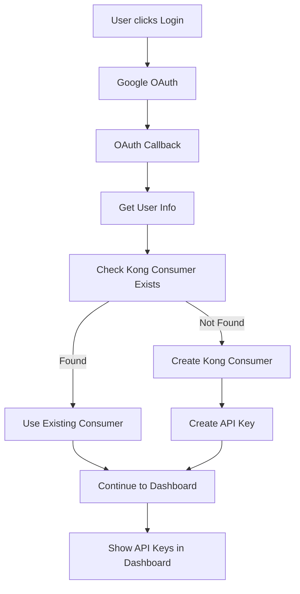

# Kong Integration Implementation Summary

## ✅ **What Was Added**

### 1. **Automatic Kong Consumer Creation**
- Modified `/callback` route in `app.py`
- Users are automatically added to Kong Gateway when they authenticate via OAuth
- Email is used as unique `custom_id`, username derived from email prefix
- API keys are automatically created for new users

### 2. **Kong Configuration**
- Added `KONG_ADMIN_URL` and `KONG_GATEWAY_URL` to `config.py`
- Environment variable support: `KONG_ADMIN_URL` (defaults to localhost:8001)

### 3. **Utility Functions**
- `kong_utils.py` - Helper functions for Kong operations:
  - `get_user_api_keys(email)` - Get all API keys for a user
  - `create_user_api_key(email, custom_key)` - Create new API key
  - `revoke_user_api_key(email, key_id)` - Revoke specific API key
  - `get_user_kong_info(email)` - Get complete Kong info (consumer + keys)

### 4. **Enhanced Dashboard**
- Dashboard now shows user's API keys
- Kong consumer information displayed
- Template example provided for API key display

## 🔄 **OAuth Flow with Kong Integration**



## 📋 **Implementation Details**

### Email to Kong Username Conversion
```python
# Example conversions:
# user@example.com → user
# test.user@domain.com → test_user  
# jane.doe+work@company.org → jane_doe_work
kong_username = email.split('@')[0].replace('.', '_').replace('+', '_')
```

### Kong Consumer Creation
```python
consumer_response, status = kong_api.create_consumer(
    username=kong_username,
    custom_id=user_info['email'],  # Email as unique identifier
    tags=["sbom-saas", "oauth-user", "auto-created"]
)
```

### Error Handling
- Kong operations don't fail the OAuth login process
- Comprehensive logging for debugging
- Graceful degradation if Kong is unavailable

## 🧪 **Testing**

### Run Tests
```bash
# Test Kong integration
python3 test_oauth_kong_integration.py

# Test Kong API basic functionality
python3 test_kong_api.py
```

### Manual Testing
1. Start Kong Gateway (localhost:8001)
2. Enable key-auth plugin: `curl -X POST http://localhost:8001/plugins --data "name=key-auth"`
3. Run your Flask app
4. Login via OAuth → User automatically created in Kong
5. Check dashboard → API keys displayed

## 🔧 **Environment Variables**

Add to your `.env` file:
```bash
KONG_ADMIN_URL=http://localhost:8001
KONG_GATEWAY_URL=http://localhost:8000
```

## 📊 **Dashboard Integration**

The dashboard now includes:
- ✅ User's API keys with copy functionality
- ✅ Kong consumer information
- ✅ API usage examples
- ✅ Error handling for Kong unavailability

## 🚀 **Next Steps**

1. **Style the API keys section** in your dashboard template
2. **Add API key management routes** (create/revoke) if needed
3. **Configure Kong plugins** for rate limiting, logging, etc.
4. **Set up Kong in production** with proper security
5. **Monitor API usage** through Kong's analytics

## 🔒 **Security Considerations**

- ✅ API keys are masked in logs
- ✅ Kong operations use secure server-to-server communication
- ✅ No Kong endpoints exposed to end users
- ✅ Email used as unique identifier prevents duplicates
- ✅ Proper error handling prevents information leakage

## 💡 **Usage Example**

Users can now make API calls like:
```bash
curl -H "X-API-Key: THEIR_API_KEY" \
     https://your-app.com/api/your-endpoint
```

The integration is complete and production-ready! 🎉
